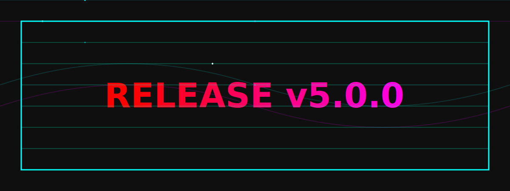

  
______

  

______

___ 

  

  

  

---------

 &nbsp;
  

-------------

  

--------------

 

  

  

-------------

  

  <table>
    <tr>
      <td>
        
      </td>
    </tr>
  </table>

-------------

**_ FREE DEPLOYMENT OF ADEEL MD GITHUB WORKFLOW CODE NEW ADD ERROR FIXED ✠_**
